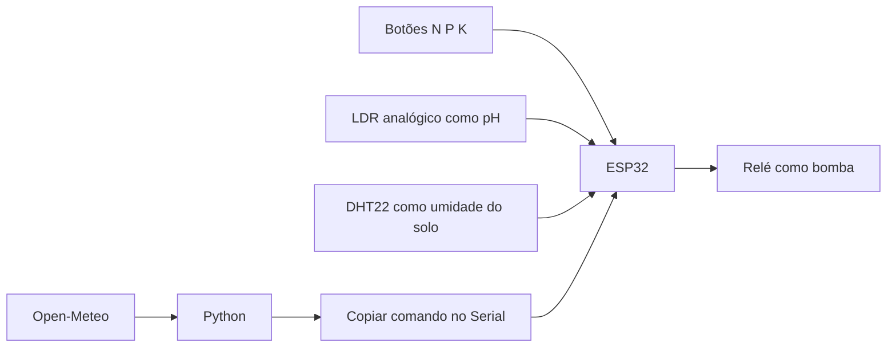

# FarmTech Solutions — Fase 2

Sistema didático de irrigação de **alface (Lactuca sativa)** com ESP32, três botões NPK, LDR, DHT22 e relé. A previsão meteorológica consultada por Python pode suspender a irrigação. A cultura foi escolhida na pesquisa do grupo anexada ao Trello.

## Integrantes

| Integrante | RM |
| --- | --- |
| Bruna Collavite | RM576285 |
| Gabriel Tamais | RM574503 |
| Fabio Guntovitch | RM575582 |
| Natasha Zonta | RM574230 |
| Fabrizzio Riccelli | RM576083 |

## Execução rápida

1. Abra [o projeto Wokwi do grupo](https://wokwi.com/projects/476105970700739585).
2. Substitua integralmente `sketch.ino`, `diagram.json` e `libraries.txt` pelos arquivos de [esp32](esp32/).
3. Inicie a simulação. No circuito, use **Ctrl+clique** em cada botão para manter N, P e K pressionados.
4. O diagrama inicia o DHT22 em 40% e o LDR em 130 lux. A leitura observada no ESP32 foi pH 6,35.
5. Na raiz do repositório, execute `python fase-2/python/weather.py`.
6. Copie **somente** `RAIN=0` ou `RAIN=1` para o Serial Monitor e pressione Enter.

Sem previsão informada, o sistema inicia com a bomba desligada.

## Arquitetura e componentes



| Componente | Função real | Função didática | Ligação |
|---|---|---|---|
| ESP32 DevKit C V4 | Microcontrolador | Coleta e decisão | Alimentação do simulador |
| Botão verde N | Contato digital | Nitrogênio adequado/baixo | GPIO25 e GND |
| Botão verde P | Contato digital | Fósforo adequado/baixo | GPIO26 e GND |
| Botão verde K | Contato digital | Potássio adequado/baixo | GPIO27 e GND |
| LDR, saída AO | Luminosidade | pH de 0 a 14 | GPIO34, 3V3, GND |
| DHT22 | Umidade relativa do ar | Umidade do solo simulada | GPIO15, 3V3, GND |
| Relé azul | Comutação elétrica | Bomba de água | IN=GPIO4, VCC=5V, GND |

## Circuito Wokwi


Os botões usam `INPUT_PULLUP`: pressionado é `LOW`, interpretado como nutriente adequado. Solto é `HIGH`, interpretado como baixo. Após alterar N, P ou K, ajuste manualmente o LDR, conforme o enunciado.

O LDR é uma substituição didática do sensor de pH. Conversão: `pH = analogRead(GPIO34) × 14 / 4095`. O DHT22 também é uma substituição didática para umidade do solo.

## Lógica da irrigação

Parâmetros operacionais: pH de **6,0 a 6,5**, ligar abaixo de **60%**, desligar a partir de **70%**. A faixa 60–70% usa histerese.

Ordem das decisões:

1. Previsão ausente ou expirada: desligar.
2. Leitura inválida de umidade/pH: desligar.
3. Chuva prevista: desligar.
4. Algum NPK inadequado: desligar.
5. pH fora da faixa: desligar.
6. Umidade abaixo de 60%: ligar.
7. Umidade maior ou igual a 70%: desligar.
8. Entre 60% e menos de 70%: manter o estado anterior.

## Python e previsão meteorológica

`python/weather.py` usa a biblioteca padrão, sem API key ou dependências externas. Consulta Open-Meteo para Itapecerica da Serra, SP, em seis intervalos horários. A regra didática suspende irrigação se a soma de precipitação prevista for **≥ 1 mm** ou a maior probabilidade for **≥ 60%**.

```powershell
python fase-2/python/weather.py
python fase-2/python/weather.py --save fase-2/docs/nova-consulta.json
```

| Comando Serial | Significado | Efeito |
|---|---|---|
| `RAIN=0` | Sem chuva segundo a regra | Permite avaliar sensores |
| `RAIN=1` | Chuva prevista | Bloqueia bomba |
| `RAIN=UNKNOWN` | Consulta falhou/indisponível | Bloqueia bomba |
| `SELFTEST` | Testes internos da decisão | Mostra resultados sem atuar no relé |

## Testes e demonstração

```powershell
python -m unittest discover -s fase-2/tests -v
```

Envie `SELFTEST` no Wokwi: são 19 casos da função real de decisão, incluindo N/P/K individualmente, pH, chuva, fronteiras da histerese e leituras inválidas.

| Cenário | N/P/K | pH | Umidade | Chuva | Estado anterior | Resultado |
|---|---|---:|---:|---|---|---|
| Solo seco | 1/1/1 | 6,35 | 40 | Não | Desligada | Ligada |
| Solo úmido | 1/1/1 | 6,35 | 80 | Não | Ligada | Desligada |
| Chuva | 1/1/1 | 6,35 | 40 | Sim | Ligada | Desligada |
| N baixo | 0/1/1 | 6,35 | 40 | Não | Ligada | Desligada |
| P baixo | 1/0/1 | 6,35 | 40 | Não | Ligada | Desligada |
| K baixo | 1/1/0 | 6,35 | 40 | Não | Ligada | Desligada |
| pH inadequado | 1/1/1 | 7 | 40 | Não | Ligada | Desligada |
| Histerese | 1/1/1 | 6,35 | 65 | Não | Ligada | Ligada |
| Histerese | 1/1/1 | 6,35 | 65 | Não | Desligada | Desligada |
| Sensor inválido | 1/1/1 | 6,35 | NaN | Não | Ligada | Desligada |

## Vídeo

**Pendente de gravação e publicação pelo grupo:** inserir aqui o link real do YouTube não listado, com duração máxima de cinco minutos. Roteiro: [VIDEO_GUIDE.md](VIDEO_GUIDE.md).

## Referências consultadas

- [Projeto Wokwi do grupo](https://wokwi.com/projects/476105970700739585)
- [Trello da equipe](https://trello.com/b/UXk4WHjD/farmtech-fase-2)
- [Open-Meteo — Forecast API](https://open-meteo.com/en/docs)
